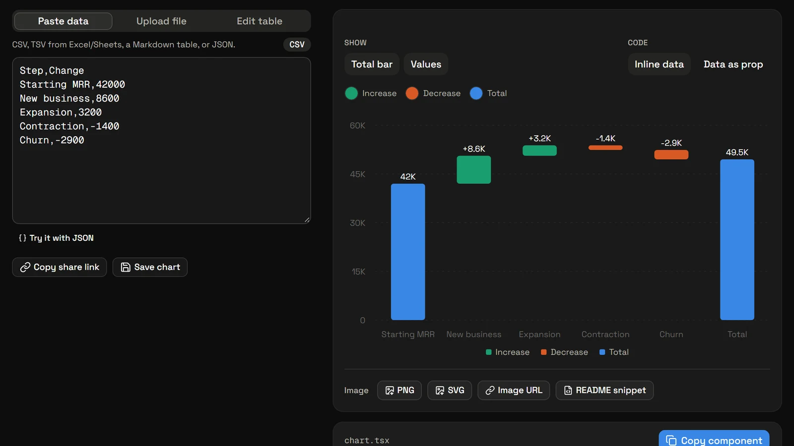
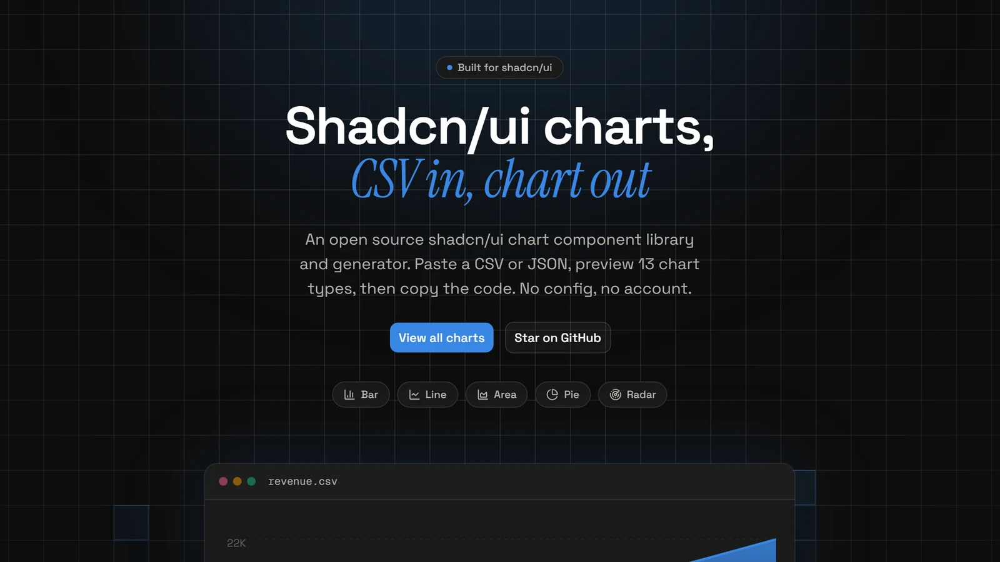
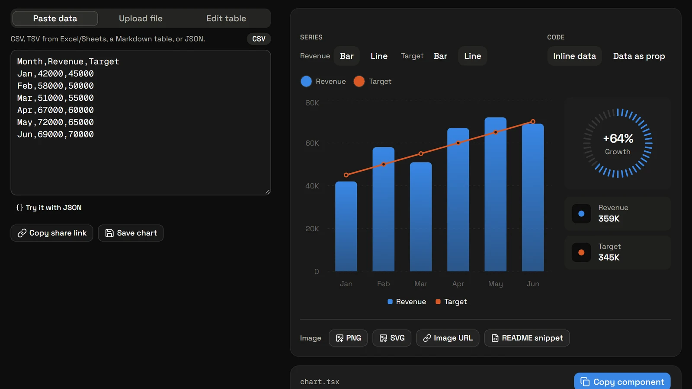
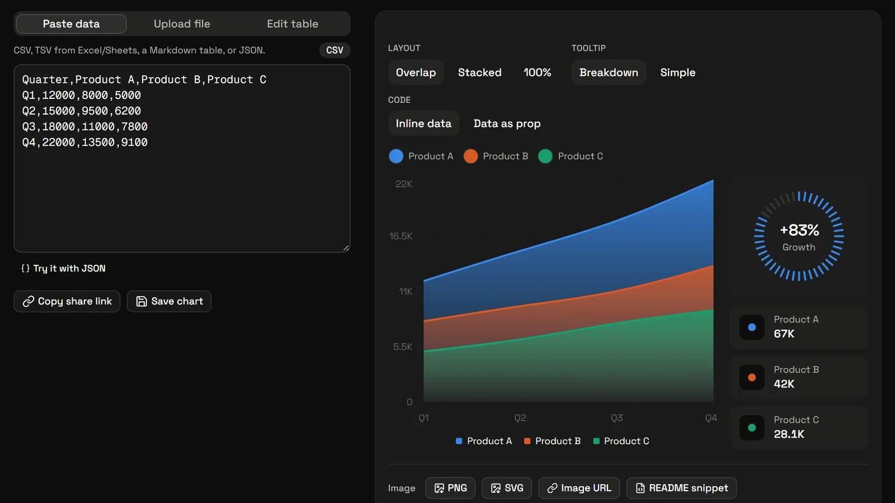
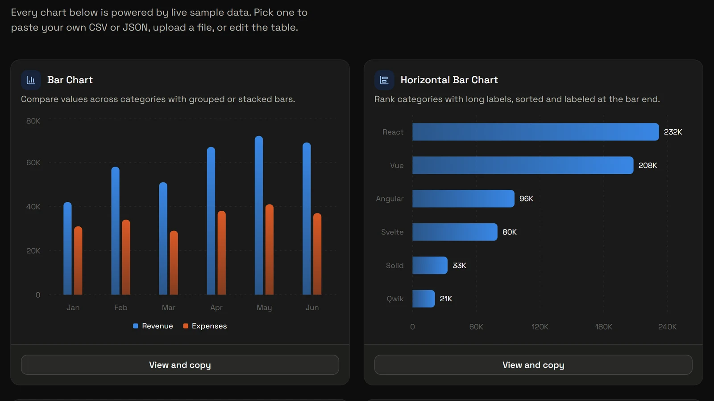

# Changelog

Chartcn components are copied into your project, so they never update on their own.
Check the **Upgrading** notes before re-copying a component.

[Website changelog](https://www.shadcndeck.com/chartcn/changelog) · [GitHub releases](https://github.com/ShadcnDeck/chartcn-shadcn-chart-generator/releases)

| Version | Date | Release |
| :-- | :-- | :-- |
| [0.5.0](#050--2026-09-25)* | 2026-09-25 | Five new charts and JSON input |
| [0.4.0](#040--2026-09-15) | 2026-09-15 | A new look for Chartcn |
| [0.3.0](#030--2026-08-13) | 2026-08-13 | Combo charts and share links |
| [0.2.0](#020--2026-07-22)* | 2026-07-22 | Colorful redesign |
| [0.1.0](#010--2026-07-21) | 2026-07-21 | First release |

\* Has an upgrade note

## 0.5.0 — 2026-09-25

### Five new charts and JSON input

Waterfall, Heatmap, Interactive Area, Horizontal Bar and KPI Sparkline bring Chartcn to 13 chart types. You can now paste JSON, TSV or Markdown tables, and export any chart as PNG or SVG.



**Upgrading:** data keys now match your column names. Re-copy and update them.

- **New:** Interactive Area, Waterfall, Heatmap, Horizontal Bar and KPI Sparkline charts
- **New:** Paste JSON, TSV or Markdown tables, not just CSV
- **New:** PNG/SVG export and an `/api/chart` image endpoint
- **Improved:** Generated code uses your own column names as data keys
- **Improved:** Per-chart SEO pages with Open Graph images
- **Fixed:** Horizontal scroll on phones

## 0.4.0 — 2026-09-15

### A new look for Chartcn

Chartcn gets its own logo, footer and FAQ. CSV numbers in any format, like 1,234.5 or 1,03,920, now parse correctly.



- **New:** ChartCN logo, footer, FAQ and share banner
- **Fixed:** Numbers like `1,234.5`, `1.234,5` and `1,03,920` now parse correctly
- **Fixed:** Blank cells leave a gap instead of dropping to zero

## 0.3.0 — 2026-08-13

### Combo charts and share links

Mix bars and lines in one chart, pick your own colors, and share any chart with a link. Components can now take their data as a prop.



- **New:** Export with inline data or a `data` prop
- **New:** Combo, Scatter and Radial charts, plus 100% stacking
- **New:** Custom colors, share links and saved charts
- **Fixed:** Pie, Radial and Scatter code failed to type-check

## 0.2.0 — 2026-07-22

### Colorful redesign

A new color palette, dark mode and dashboard-style charts with stat cards and a growth gauge.



**Upgrading:** re-copy components to get the new styling.

- **New:** Dark mode, stat cards and a growth gauge
- **Improved:** New color palette and restyled charts

## 0.1.0 — 2026-07-21

### First release

Paste a CSV, preview it as a Bar, Line, Area, Pie or Radar chart, and copy a ready-to-use shadcn/ui component.



- **New:** Bar, Line, Area, Pie and Radar charts
- **New:** Paste or upload CSV, copy the component

---

<details>
<summary><b>How to release</b> (maintainers)</summary>

1. Add a 1600×900 (16:9) screenshot to `public/changelog/v0.6.0.webp`.
2. Add the release to the top of [`lib/changelog.ts`](./lib/changelog.ts), importing the screenshot. This updates the site badge and the `/changelog` page.
3. Add it here and bump the version in [`package.json`](./package.json).
4. Tag and publish:
   ```bash
   git tag v0.6.0 && git push origin v0.6.0
   gh release create v0.6.0 --title "v0.6.0" --notes-file .github/RELEASE_DRAFT_v0.6.0.md
   ```
</details>
